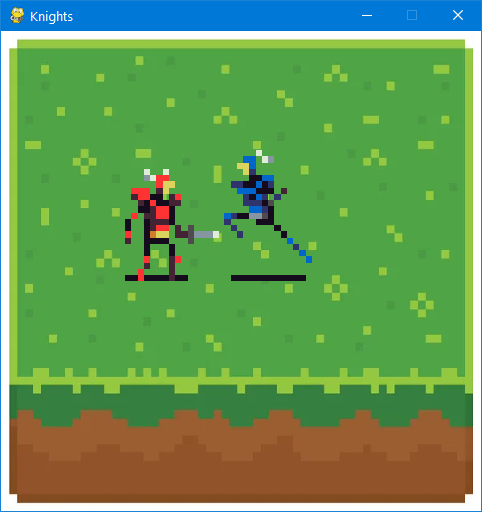
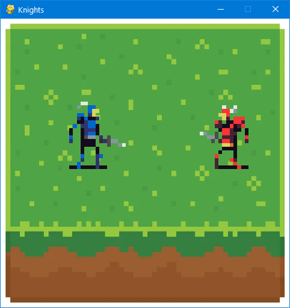
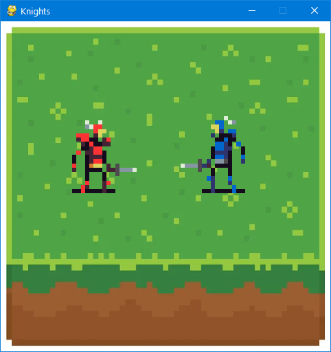

The program implements a two-player game.

Each player controls a character:

1. `WASD` - for the blue one. `F` - to attack
2. `IJKL` - for the red one. `H` - to attack

There are idle, walking, and attacking animations for each character.

The area played on is restricted to the borders of the green platform.  

Here are some illustrations of the program:

